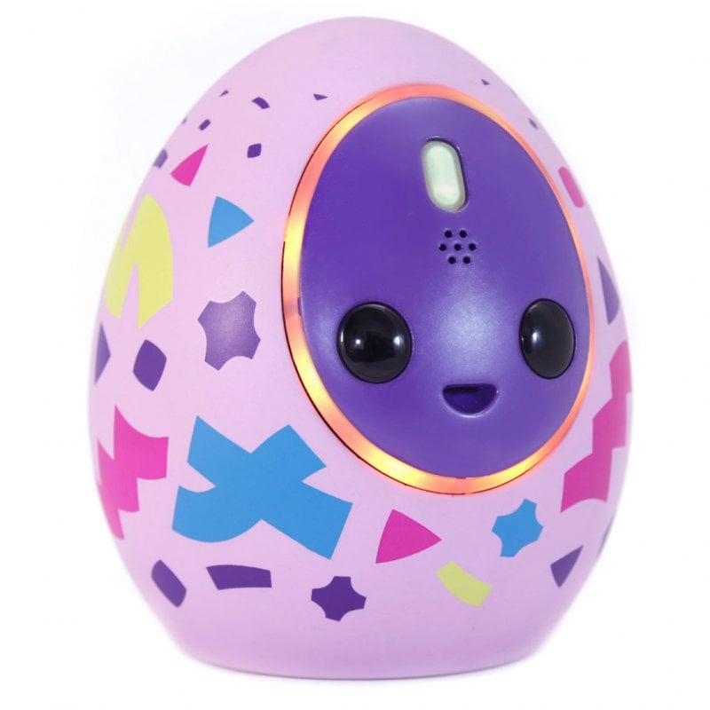

# Melbits POD — Firmware

> *A buttonless BLE smart toy that pairs through the screen.*

<p align="center">
  
</p>

Firmware and embedded tooling for the **Melbits POD**, a connected smart toy
shipped by Melbot Studios, S.L. in **2020**.
The POD is a buttonless, sensor-rich BLE peripheral that talks to a Unity
companion app, runs on-device mini-game logic, signals state through
LEDs / audio / haptics, and pairs with the tablet through an optical
side-channel I designed — **Magic Link**.

I joined Melbot Studios as **Tech Lead** for the POD program and was
responsible for the embedded side of the product end-to-end: firmware
architecture, BLE stack integration, bootloader and OTA, manufacturing
and certification tooling, asset pipelines, and the host-side libraries
that talk to the device. This repository is the firmware portion of
that work.

> **Publication notice.** This source is published as a portfolio
> archive with the express written authorization of Melbot Studios, S.L.
> All rights remain with Melbot Studios — see [`LICENSE`](LICENSE) for the
> full terms. Vendor SDKs, signing keys, and proprietary audio assets were
> removed before publication; see [`SETUP.md`](SETUP.md) for the restore
> path.

---

## What the product does

The user opens the companion app (built in Unity) and finds *Melbits* —
small digital creatures. To raise one, the player **transmits it to the
POD** through Magic Link (Bluetooth Low Energy + an optical side-channel — more on that below), then takes the POD into the real world and
completes a mission: expose the creature to light or to darkness, to
cold or to warmth, keep it still or shake it around. The POD reads its
sensors, runs the activity logic on-device, and communicates state back
to the child through LED animations, audio cues, and vibration. After a
period, the Melbit is **transmitted back to the tablet** and either
*evolves* (mission succeeded) or *turns into a virus* (mission failed)
that goes on to attack other Melbits in the app.

There is **no display, no buttons** (a recessed reset under the case is
the only exception). Every interaction is sensed: tilt, shake, presence
on the Magic Link, light, temperature, motion gesture.

📽️ [Watch the video](https://youtu.be/grtymcMHhEQ)

---

## Target

| | |
|---|---|
| MCU | **Nordic nRF52810** — Cortex-M4, **no FPU** (soft float ABI), 192 KB flash, 24 KB RAM |
| BLE stack | Nordic SoftDevice **S112** v6.1.1 (peripheral-only) |
| App flash budget | **92 KB** after SoftDevice (100 KB) + bootloader (24 KB) + settings (4 KB) |
| App RAM budget | **~15 KB** after SoftDevice reservation |
| Toolchain | SEGGER Embedded Studio 4.16+ |
| Lines of firmware code | ~14,000 in `Main/Project/src/`, plus bootloader, board-test and cert images |

Working inside ~15 KB of RAM and ~92 KB of flash — with a full BLE
peripheral stack, signed DFU, FFT-based optical decoding, a polyphonic
fixed-point synth, an on-device game engine, encrypted application
protocol, file system, manufacturing test mode, and asset playback —
shaped almost every architectural decision in this codebase.

Additionally, because of the lack of an FPU, and the ABI taking between
1 and 2 KB of precious ROM, everything was coded in fixed point
arithmetic.

---

## What's in this repository

```
.
├── Main/                          Production firmware
│   ├── Project/src/
│   │   ├── Pod/                   Application modules — activity engine, BLE FSM, MagicLink decoder,
│   │   │                          file server, power, LEDs, motion, encrypted protocol, ...
│   │   ├── HAL/                   Hardware abstraction (BLE_SD, Flash, SAADC, PWMAudio, RTC, I2C, ...)
│   │   ├── Drivers/               Peripheral drivers (e.g. SC7A20 3-axis accelerometer)
│   │   ├── Audio/                 Fixed-point synth and asset playback
│   │   └── nRF/                   Vendor MDK landing zone (removed from publication)
│   ├── Feedbacks/                 Renoise .xrni instrument designs (LED + audio choreography)
│   └── config/                    Nordic SDK component configuration
│
├── Secure Bootloader/             Signed-DFU capable bootloader (ECDSA P-256, dual-bank)
├── Board test firmware (UART)/    Manufacturing / board bring-up firmware
├── Certification/radio_test/      RF certification firmware (FCC / CE)
├── DFU/keys/                      Public half of the DFU signing keypair (private key not published)
└── Tools/                         Host-side tooling
    ├── LZSS/                      LZSS encoder/decoder (Okumura, public domain)
    └── ModConverter/              Renoise XRNS → on-device song/LED-track converter
```

---

## Highlights

### 🪄 Magic Link — optical BLE pairing (my design)

Pairing a phone or tablet with a BLE peripheral that has no screen, no buttons,
and a child as the operator is a UX nightmare. The standard solutions
(PIN entry, NFC tap-to-pair, scan-and-select) all fail for a 6-year-old.

**My solution:** the tablet renders a circular pattern on the screen
from inside the Unity app — the **LightPort**, a sequence of light and
dark frames at a known carrier frequency, also implemented by me on the
tablet side. The POD has a **second photodiode embedded in its base**,
separate from the ambient light sensor on top. When the child sets the
POD down on top of the LightPort on the tablet, the bottom photodiode
reads the screen, the firmware demodulates the optical signal, and the
tablet's nonce is transferred over this optical side-channel. BLE
advertises that nonce in the vendor data portion of the advertising packet
so the tablet knows which device to connect to in case there's more than one
in range. BLE pairs in just works mode, and the protocol is encrypted using a
key derived from the nonce. This way no explicit toy-tablet bonding is required,
which is ideal for activities such as transferring Melbits between friends.

The result is "**put the toy on the screen and it pairs**" — zero
configuration, intrinsically directional (only the device that sees
the pattern pairs, so a sibling's POD across the room can't intercept),
and physically intuitive for the target age range.

Implementation lives in:

- [`Main/Project/src/Pod/MLINK.c`](Main/Project/src/Pod/MLINK.c) — Magic Link receiver state machine
- [`Main/Project/src/Pod/ML/MLDecoder.c`](Main/Project/src/Pod/ML/MLDecoder.c) — symbol decoder + nonce recovery
- [`Main/Project/src/Pod/ML/mlink_fft.c`](Main/Project/src/Pod/ML/mlink_fft.c) — fixed-point FFT on the ADC stream
- [`Main/Project/src/Pod/ML/mlink_dsp.c`](Main/Project/src/Pod/ML/mlink_dsp.c) — windowing, magnitude estimation, carrier lock
- [`Main/Project/src/HAL/SAADC.c`](Main/Project/src/HAL/SAADC.c) — SAADC pipeline feeding the decoder via DMA

All of it runs on a **Cortex-M4 with no FPU**. The DSP is integer / Q-format throughout.

### 🔐 Secure DFU bootloader and OTA updates

Production PODs were updateable in the field through the companion app.
The bootloader (in [`Secure Bootloader/`](Secure%20Bootloader/)) is based
on Nordic's secure DFU but tuned for our memory budget and our update
workflow:

- **ECDSA P-256 signed images** (the public key is embedded in the
  bootloader at [`Secure Bootloader/public_key.c`](Secure%20Bootloader/public_key.c)).
- **Dual-bank updates**: the new image lands in a free bank, signature
  verifies, then bootloader settings get rewritten and the new image
  takes over on the next boot.
- **BLE transport** for the update — the app talks DFU service to the
  bootloader directly, no separate cable / dongle.
- **Based on Nordic's sample bootloader project**, heavily modified for
  our memory budget, image layout, factory workflow, and update flow.
- **Factory image generator** that produces the combined SoftDevice +
  bootloader + app + settings hex used in mass production
  (see [`Main/Project/Buildscripts/`](Main/Project/Buildscripts/)).

### 🎵 Audio asset pipeline — Renoise to embedded synth

The POD plays both **streamed PCM samples** (decoded on-device through
a fixed-point GSM-style codec — *decoder omitted from this publication
for license reasons*) and **chiptune-style synthesized music** driven
by a custom polyphonic synth that runs in real time on the Cortex-M4
without an FPU.

The PCM channel uses GSM because it offered the best balance between
audio quality, bitrate, and decoder Flash + RAM footprint on this MCU.
**Audio files don't ship inside the firmware image** — they're bundled
with the companion app.
These files are preprocessed offline before building the app package,
run through a host-side pipeline that **equalizes each clip to compensate
for the speaker's resonant frequencies**, and encodes them into GSM.
The app transfers audio files to the POD over BLE on demand. The POD caches
them in Flash for later playback.

The synth side is authored in **[Renoise](https://www.renoise.com)**,
the tracker. Each instrument is a `.xrni` and each song a `.xrns`. A
host-side converter — adapted from
[DuinoTune](https://github.com/blakelivingston/DuinoTune) — turns those
Renoise files into C source tables that get linked into the firmware
and played back by the on-device synth.

- Synth core: [`Main/Project/src/Audio/synth.c`](Main/Project/src/Audio/synth.c) — voice mixing, envelopes, pitch glide, bitcrush, channel types (SQR, TRI, NOISE, PWM, PCM, CMD)
- Asset converter: [`Tools/ModConverter/xrns2tt.py`](Tools/ModConverter/xrns2tt.py)
- Output stage: [`Main/Project/src/HAL/PWMAudio.c`](Main/Project/src/HAL/PWMAudio.c) — PWM-DAC audio out
- Instrument designs: [`Main/Feedbacks/`](Main/Feedbacks/) — the actual `.xrni` files used in the shipped product

Resulting mixed audio is streamed over DMA to one of the hardware PWM controllers, and we do cheap PWM DAC with an external LPF, + a class-D amplifier that is powered on demand.

### 💡 LED and haptic choreography — also authored in Renoise

This is one of the parts I'm fond of: the **LEDs are driven by tracker tracks
just like the audio**. Renoise has named "instruments" mapped to LED
channels (`PWM_R`, `PWM_G`, `PWM_B`, `PWM_Q1..Q4`, `PWM_VIB` for the
vibration motor), and the composer writes LED and haptics animations *in the same
tool, on the same timeline* as the music. A single `.xrns` song
produces both the audio track and a synchronized LED+vibration track
that the firmware plays back together.

This let the sound designer choreograph audiovisual feedback
holistically instead of coordinating between two pipelines. From the
firmware side it's just another channel type in the synth
(`CMD` / `PWM_*` voices) — the same scheduler that ticks the audio
ticks the LEDs.

See the instrument library in [`Main/Feedbacks/common/`](Main/Feedbacks/common/).

### 📦 Box mode — factory ship state

Devices ship in **Box Mode**: a deep-sleep variant.
The exit transition is triggered by plugging it into a USB power source
or by a hardware reset. This lets a POD sit on a shelf for months without
draining the battery.

See [`Main/Project/src/Pod/BoxMode.c`](Main/Project/src/Pod/BoxMode.c) and the entry point in [`Main/Project/src/Pod/Pod.c`](Main/Project/src/Pod/Pod.c).

### 🔋 Power and battery management

The POD ran from a small Li-Po cell with USB charging. On a coin-cell-class
power budget you cannot afford lazy decisions about peripherals.

- Custom **per-peripheral reference-counted activation** (`MBT_DEF_SHARED_RES` macro in [`utils.h`](Main/Project/src/utils.h)) — every consumer of the I²C bus, the SAADC, the boost converter, etc. requests and releases the resource; the underlying hardware turns on exactly when at least one client needs it and off the moment the last one releases.
- **Battery state machine** with charge/discharge curve compensation, USB-presence detection, and per-state visual feedback ([`Main/Project/src/Pod/Power.c`](Main/Project/src/Pod/Power.c), [`Main/Project/src/Pod/UI_battery.c`](Main/Project/src/Pod/UI_battery.c)).
- **Multi-rate SAADC** scheduler ([`Main/Project/src/HAL/SAADC.c`](Main/Project/src/HAL/SAADC.c)) that interleaves battery voltage, ambient light, temperature, and the Magic Link photodiode on the same ADC at different rates. This works around a physical constraint that the RGB LED, and the light sensor share the same physical frosted plastic window.

### 🎮 On-device activity engine

The POD is the **sensor sampler** for each Melbit mission. While a
mission is active, the firmware samples the relevant signals — ambient
light, temperature, motion intensity, stillness vs agitation — and
**integrates them over time** into accumulated state that the companion
app reads back when the mission ends. The **success / failure verdict
is computed on the app side** from those accumulated readings; the POD
owns the data acquisition, the time-integrated state machine, and the
real-time user feedback (LEDs, audio, haptics). The app owns the game
rules and the persistent world state.

- [`Main/Project/src/Pod/Activity.c`](Main/Project/src/Pod/Activity.c) — generic activity dispatcher
- [`Main/Project/src/Pod/Activity_Evolution.c`](Main/Project/src/Pod/Activity_Evolution.c) — evolution / virus logic
- [`Main/Project/src/Pod/Motion.c`](Main/Project/src/Pod/Motion.c) — gesture recognition on top of the accelerometer driver

### 👆 Buttonless UX through gesture recognition

Every user action — wake, confirm, dismiss, "spend" energy, abort —
is a gesture: a tap, a double-tap, a tilt, a shake, an orientation
change. Detection runs on top of the **SC7A20 accelerometer** via the
driver in [`Main/Project/src/Drivers/Accel/SC7A20.c`](Main/Project/src/Drivers/Accel/SC7A20.c), with gesture
classification in [`Main/Project/src/Pod/Motion.c`](Main/Project/src/Pod/Motion.c).

### 🛡️ Encrypted application protocol over BLE

On top of the BLE Nordic UART Service we ship a custom application
protocol — *Playground* (`POD_PG_*`) — used by the companion app to
push activities, fetch file system entries, control LEDs/audio,
stream sensor data, and trigger DFU.

- **AES-CTR encryption** of the application payload, keyed during the
  Magic Link handshake — see [`Main/Project/src/HAL/Crypt.c`](Main/Project/src/HAL/Crypt.c)
  (built on Nordic's `sd_ecb_block_encrypt`) and the protocol layer in
  [`Main/Project/src/Pod/Playground.c`](Main/Project/src/Pod/Playground.c).
- Opcodes, flow control and event semantics are documented inline in
  [`Main/Project/protocol.txt`](Main/Project/protocol.txt) and
  [`Main/Project/manufdata and reconnection.txt`](Main/Project/manufdata%20and%20reconnection.txt).
- Custom advertising manufacturer data with state flags (Magic Link
  detected, reconnection in progress, etc.) — see
  [`Main/Project/src/Pod/BLE.c`](Main/Project/src/Pod/BLE.c) and [`Main/Project/src/HAL/BLE_Adv.c`](Main/Project/src/HAL/BLE_Adv.c).
- **File-Based abstraction**: The protocol is in part a pseudo-FTP, where the POD exposes a number of endpoints as "files" identified by a unique numerical ID. Some are RW, others are W-only. Some live in RAM, and some others are backed up by Flash storage. Executing some commands involves writing a specific blob to a specific file. Bulk data can also be written to a file endpoint. This is used when transmitting GSM-encoded audio files for the device to play. This abstraction makes the protocol lightweight in terms of Flash footprint, and simplifies software design.

### 🔧 Manufacturing test firmware

A separate firmware image — [`Board test firmware (UART)/`](Board%20test%20firmware%20(UART)/) — boots into a UART
command parser used during board bring-up and end-of-line test:

- Per-peripheral exercise commands (each LED channel, motor, speaker, accelerometer self-test, photodiode read, BLE radio).
- Scripts to flash the test image, run the sequence, capture results, and then flash the production image (`hex/flashtestprogram.bat`, `hex/buildDFUpackage.bat`, `hex/generateblsettings.bat`).
- Designed so the contract manufacturer could test every PCB before assembly with a known-good UART tester.

### 📡 RF certification firmware

[`Certification/radio_test/`](Certification/radio_test/) is the carrier-wave / continuous-modulation
firmware used for FCC and CE radiated emission tests during product
certification. Built on Nordic's `radio_test` example with the POD's
board configuration (antenna, matching network, GPIO map).

---

## Architecture

```
┌─────────────────────────────────────────────────────┐
│              Application (Pod/)                     │
│  Activity engine · BLE FSM · MagicLink · LEDs ·     │
│  Motion · Power · FileServer · Playground proto ·   │
│  StreamServer · TestMode · Vibration · UI           │
├─────────────────────────────────────────────────────┤
│                 HAL                                 │
│  BLE_SD · BLE_Adv · Flash · SAADC · PWMAudio ·      │
│  SoftPWM · I2C · RTC · GPIO · Crypt · Clocks ·      │
│  System · UICR · Debug                              │
├─────────────────────────────────────────────────────┤
│             Drivers (Drivers/)                      │
│  SC7A20 (3-axis accelerometer) · Audio synth        │
├─────────────────────────────────────────────────────┤
│  Nordic SoftDevice S112 · nRF5 SDK 15.3.0           │
└─────────────────────────────────────────────────────┘
```

Strict layering with **no upward calls**: the HAL never knows about
application modules; application modules never poke registers
directly. Every shared resource (radio, ADC, I²C, audio output, boost
converter) is **reference-counted** so that any combination of
features can be active simultaneously without ad-hoc enable / disable
logic at each call site.

---

## What I'd do differently in 2026

This firmware shipped in 2020, on top of the toolchain and patterns that
were idiomatic at the time. If I were starting the POD program from
scratch today, these are the deliberate changes I would make. I am
listing them here because evaluating one's own past work honestly is, in
my opinion, as much a part of senior engineering as building it in the
first place.

### Toolchain and platform

- **Migrate to Zephyr RTOS / nRF Connect SDK if memory constraints allow.** Nordic deprecated the
  nRF5 SDK + SoftDevice combo that this project uses. Zephyr brings a
  preemptive RTOS, a device tree, upstream-maintained drivers, a
  proper Bluetooth Host stack, MCUboot for signed updates, and a
  west-based workspace model that makes dependency management
  tractable. The Application / HAL / Drivers separation in this code
  maps cleanly onto Zephyr's `lib` / `drivers` / `subsys` model.
- **Replace SEGGER Embedded Studio + JLink scripts with CMake +
  `arm-none-eabi-gcc` + VS Code + `cortex-debug`.** Reproducible
  builds, free toolchain, no vendor lock-in, runs in CI.
- **Static analysis in the build.** `clang-tidy`, `cppcheck`,
  optionally MISRA-aware tooling where the domain warrants it. Treat
  warnings as errors from day one rather than retrofitting later.

### Testing and CI

- **Unit tests for the portable layers.** The activity engine, the
  Playground protocol parser, the LED scheduler, the gesture
  classifier, the file server state machine — all of these are
  testable on the host with Ceedling / Unity. None of them require a
  real radio or a real accelerometer.
  - In this regard, a "POD Simulator" desktop app was built for QA purposes. The core part of this firmware was built as part of a desktop app that allowed to test and simulate the pod's features.
- **Hardware-in-loop tests for the parts that do.** A bench rig with
  a known-good POD, an instrumented light source for Magic Link, and
  an actuator for shake gestures, run nightly on a self-hosted runner.
- **Fuzz the Playground protocol parser.** It accepts BLE input from
  an untrusted client; libFuzzer / AFL on the host build would have
  found edge cases that today live in the realm of "we never saw it
  in QA".
- **GitHub Actions matrix build** that compiles every project variant,
  enforces a **flash and RAM budget per PR** (the device has 92 KB of
  app flash; any PR that pushes it past a budget fails the check),
  and publishes signed artefacts on tag.

### Security

- **Replace AES-CTR with an AEAD construction.** The current
  application-layer crypto in [`Playground.c`](Main/Project/src/Pod/Playground.c)
  is AES-128 in CTR mode with a Magic Link-derived nonce. CTR provides
  confidentiality but **no integrity**: a man-in-the-middle with known
  plaintext can flip arbitrary ciphertext bits and the device cannot
  tell. The right primitive is AES-128-GCM (the nRF52 has a hardware
  ECB peripheral that can implement it efficiently) or ChaCha20-Poly1305
  in software. I would have caught this if the system had been
  threat-modeled formally rather than incrementally.
- **Make the Magic Link handshake mutually authenticated.** Today the
  device trusts whatever nonce arrives optically. A signed challenge
  (device → tablet) on top of the optical transfer would close the
  asymmetry.

### Architecture

- **Break up the monolithic modules.** [`TestMode.c`](Main/Project/src/Pod/TestMode.c)
  at 1,337 lines and [`Playground.c`](Main/Project/src/Pod/Playground.c)
  at 818 lines are honest reflections of "I had a deadline and the
  feature kept growing", but today I would refactor each into a
  command-dispatch table + per-command handler files, which would also
  unlock cheap unit testing.
- **Architecture Decision Records.** A small `docs/adr/` directory
  with one file per decision (why nRF52810 and not nRF52832, why
  bare-metal + SoftDevice and not an RTOS, why a custom file format
  and not LittleFS, why an in-house GSM-style audio codec and not
  Opus) — written *at the time of the decision*. Future engineers
  reading the code would have a reason for everything they touch.

### Productionization

- **Crash observability for the fleet.** A retained-RAM ring buffer of
  the last N function entries (instrumented at compile time) plus a
  fault handler that snapshots `PC`/`LR`/`SP`/the call trail to
  retained RAM, exposed via the comms protocol for later retrieval.
  Production embedded without post-mortem data is flying blind.
- **A/B firmware rollback.** The current secure DFU swaps the image
  in and runs it; if the new image hangs before mark-as-valid, the
  device is bricked from the user's perspective. A proper A/B scheme
  with a "validate within N boots or revert" policy is a small amount
  of bootloader code and a large amount of fleet resilience.
- **Power budget enforcement.** Each operational state (advertising,
  connected idle, mission running, charging) gets a published current
  budget, instrumented with a Nordic PPK / Otii, and regressions are
  caught automatically in the same HIL bench.

### Asset pipeline

- **Replace the `.bat` + GNU make + custom Python combo** with a
  single Python CLI (Click + Poetry / uv), producing reproducible
  asset hashes and validating each `.xrns` against a JSON schema
  before conversion. The current pipeline works; it just hides what
  it depends on.

None of this invalidates what shipped — the POD worked in the field,
passed certification, and made it onto retail shelves. But shipping
correctly in 2020 and engineering correctly in 2026 are two different
bars, and a portfolio that pretends otherwise is not useful to anyone.

---

## Companion repositories *(to be published)*

The firmware is one piece of a larger system. The remaining components
will be published as separate portfolio repositories under the same
authorization:

- **`melbits-pod-comms`** — Cross-platform BLE communication library
  used by the Unity companion app and the factory tools. **C++** core
  with a **C# / .NET** binding layer; implements the Playground
  protocol, Magic Link orchestration, DFU client, and the file-server
  client.
- **`melbits-pod-factory-app`** — Desktop application used by the
  contract manufacturer to provision and test PODs during assembly
  (serial number assignment, factory image flashing, end-of-line test
  orchestration, calibration data write-out to UICR).

---

## My role

I joined Melbot Studios as **Tech Lead** for the POD program. I was the only firmware engineer for this project, and owned
the full **device ↔ tablet** communication path, end-to-end:

- **Early prototyping**: made a couple of proof-of-concept working designs before the final product. Involving schematics, board design and assembly, and early POC firmware.
- **Participated in component selection and final hardware design**: Iterated with our partner in China to produce the final design 
- **Firmware architecture**: Design and implementation of the entirety of the firmware, including but not limited to: the HAL / Drivers / Application layering,
  the reference-counted resource pattern, the BLE FSM, the activity
  engine, the file system + file server, the Playground protocol.
- **Magic Link**: concept, optical protocol design, FFT-based
  fixed-point decoder on the device, *and* the **LightPort** renderer
  on the Unity side that drives the optical channel from the tablet. This was a creative approach I came up with to work around the BLE connection establishment in a kid-friendly way
- **Secure DFU bootloader**: Nordic SDK baseline + customizations for
  our memory budget, signing workflow, factory image generation.
- **Audio + LED pipeline**: synth core, Renoise-based authoring
  toolchain, ModConverter adaptation, PWM-DAC output stage.
- **Cross-platform tablet comms**: the **iOS / Android** companion
  software that talks to the POD, including the BLE stack, the
  Playground protocol client, DFU client, and the LightPort renderer.
  Published separately (see *Companion repositories* above).
- **Manufacturing tooling**: the UART board-test firmware, the factory
  image builders, the end-of-line test orchestration.
- **RF certification**: running and iterating with our partner in China on the certification
  firmware until FCC / CE pass.
- **OTA pipeline**: tooling to build production firmware images and
  handle distribution to the field via bundled companion-app updates
  or direct download from the internet.

Beyond the POD program, during my time at Melbot Studios I also
**programmed and optimized other titles** the studio shipped — work
that lives outside this repository.

The non-embedded parts of the POD product (industrial design,
electronics, the rest of the Unity companion app, sound design, game
design) were the work of the rest of the Melbot team — I owned the
embedded layer, the cross-platform comms, and the contract between
them and everything else, reporting directly to the CEO.

---

## Building

This is a **portfolio archive**, not a turn-key buildable tree. Vendor
SDKs, signing keys, and proprietary audio assets were removed before
publication. See [`SETUP.md`](SETUP.md) for the reference steps to
reconstruct a buildable environment.

---

## License

This repository is published under a portfolio-only license. All
rights remain with Melbot Studios, S.L. Source-available for reading
and study; redistribution, commercial use, and derivative works are
not permitted without prior written consent. See [`LICENSE`](LICENSE)
for full terms and the list of third-party components.

---

## Author

**Miguel Angel Exposito** — Tech Lead, Senior Software Engineer | C++ · Real-Time Systems · Cross-Platform · Embedded Software · 3D · Linux.
Find me on [LinkedIn](https://www.linkedin.com/in/miguel-angel-exposito) · [GitHub](https://www.github.com/mikedottech).
